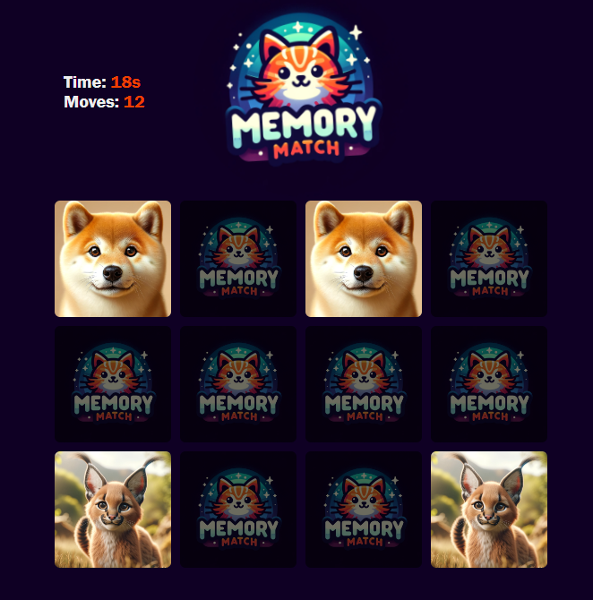

# Memory Match Game

## [**Live Demo**](https://spojrzenie.github.io/memory-match/)

## About
Memory Match is a fun and interactive game designed to test and improve your memory skills. The game is built using modern web technologies and is a great example of interactive web application development.

## Technologies Used
- **React:** A JavaScript library for building user interfaces.
- **Sass (SCSS):** A preprocessor scripting language that is interpreted or compiled into Cascading Style Sheets (CSS).
- **TypeScript:** A strongly typed programming language that builds on JavaScript, giving you better tooling at any scale.
- **HTML & CSS:** Standard technologies for building and designing web pages.

## Game Mechanics
The game features a set of cards that players must match based on their names. The game tracks the number of moves and the time taken to match all pairs, offering an option to save these results.

### Key Components
- **Game.tsx:** Manages the core gameplay logic, including card shuffling, flipping, and matching.
- **Results.tsx:** Handles the display and saving of the game results.

### How to Play
- Cards are shuffled and laid out face down.
- Players flip two cards at a time to find a matching pair.
- The game tracks the number of moves and the time taken to match all pairs.
- Players can choose to save their score at the end of the game.

## Development Purpose
This project was developed as an exercise in JavaScript, React, and Sass, aiming to demonstrate proficiency and skill in these technologies.

## Local Setup
To run this project locally:
1. Clone the repository.
2. Install dependencies using `npm install`.
3. Start the development server using `npm start`.
4. Open `http://localhost:3000` to view the game in the browser.

---

Developed with ❤️ by Chris Janiewicz
